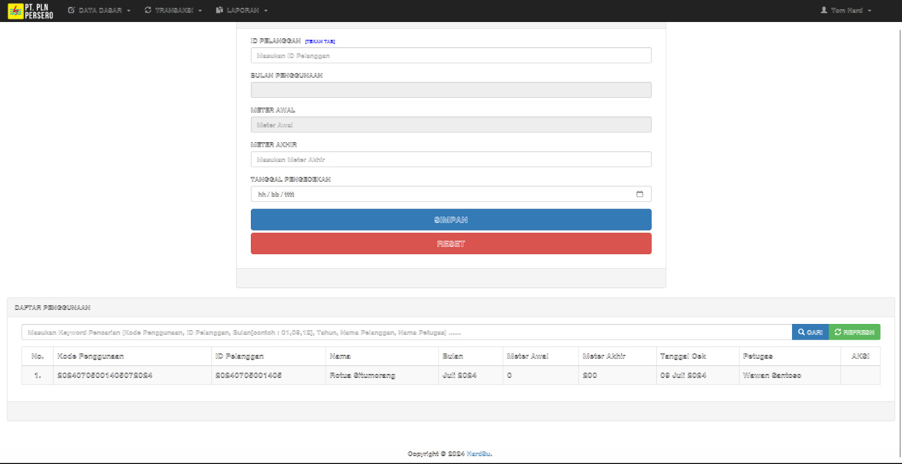
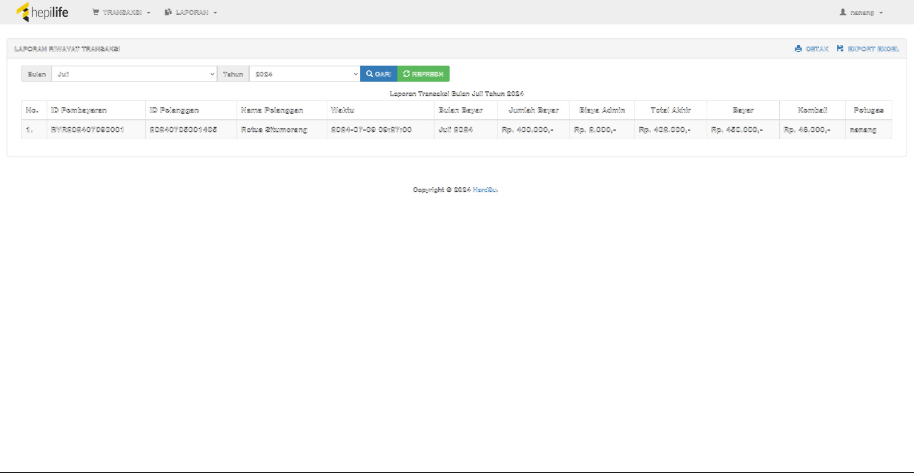

# Payment-Setroom(Aplikasi Pembayaran Listrik Pasca Bayar)
Sebuah aplikasi berbasis web yang bertujuan untuk membayar listrik pasca bayar

## Fitur
* Dashboard


* Daftar Penggunaan Listrik


* Riwayat Pembayaran Listrik


## Teknologi
* PHP 5
* MySQL
* HTML
* CSS
* Javascript
* Bootstrap 

## Info Developer
Jika ada pertanyaan bisa hubungi kontak dibawah : 
* [Email](mailto:17210801@bsi.ac.id@gmail.com) - 17210801@bsi.ac.id
* [LinkedIn](https://www.linkedin.com/in/TomHardHasudunganTampubolon/) - Tom Hard
* [Instagram](https://www.instagram.com/tomharrdd/) - @tomharrdd

```
 Ku Coding Kau dengan Bismillah
```


